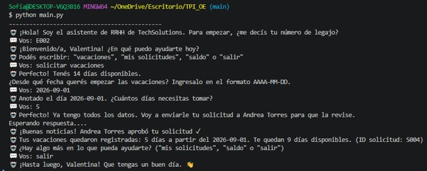
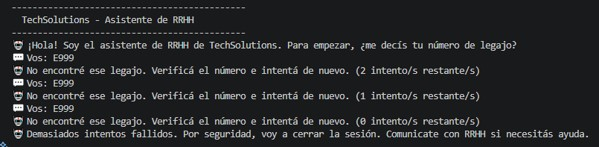
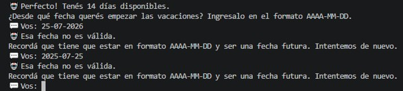
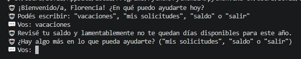
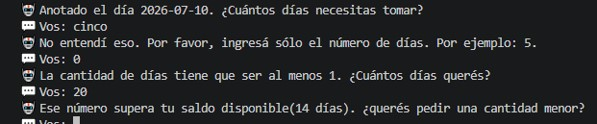
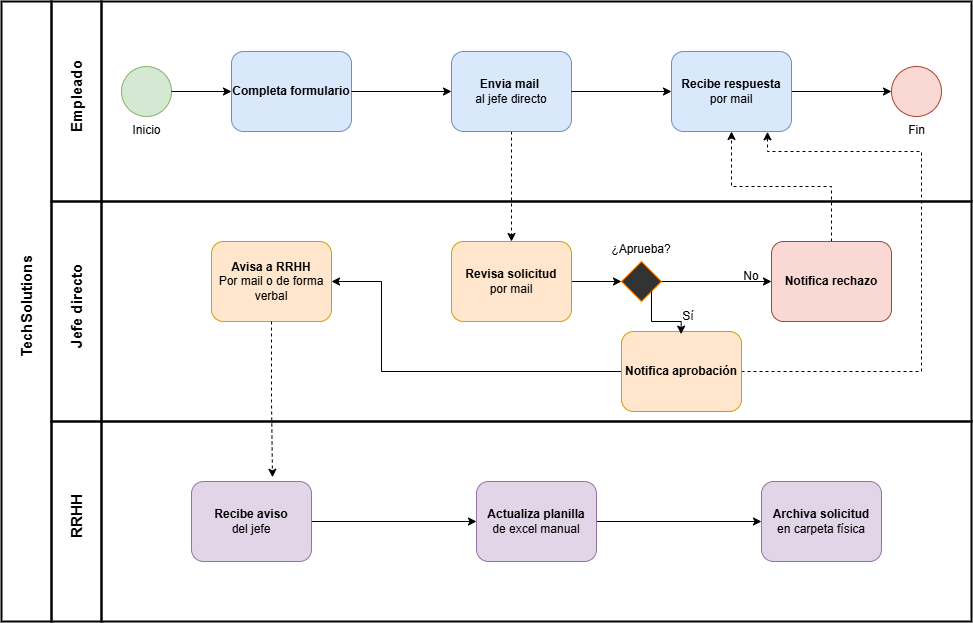
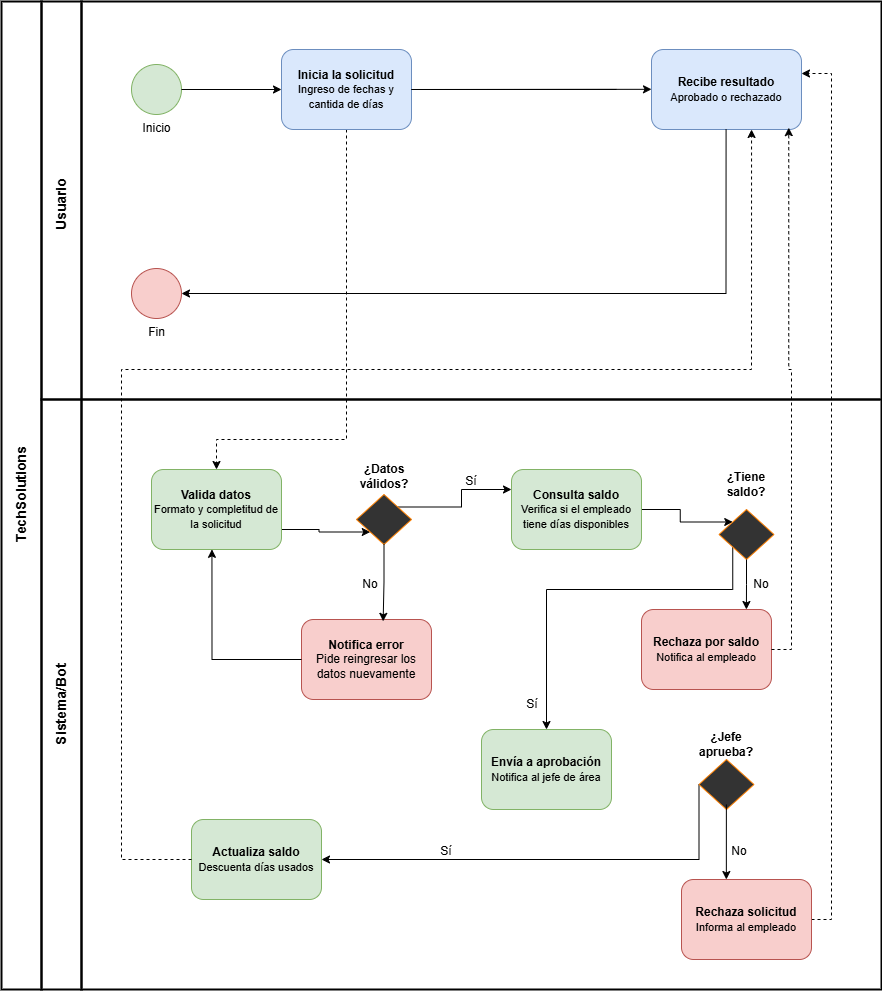

# 🤖 Asistente de RRHH — Solicitud de Vacaciones

## Datos del Trabajo

| Campo | Detalle |
|---|---|
| **Título** | Trabajo Práctico Integrador - Simulador de Chatbot para Gestión de Solicitudes de Vacaciones |
| **Materia** | Organización Empresarial |
| **Institución** | Universidad Tecnológica Nacional (UTN) — Tecnicatura Universitaria en Programación a Distancia |
| **Año lectivo** | 2026 |
| **Alumna** | Sofía Sachetti |
| **Comisión** | 7 |

---

## Descripción General

Simulador de chatbot de consola desarrollado en Python que automatiza el proceso de solicitud de vacaciones para la empresa ficticia **TechSolutions** El sistema reemplaza un proceso manual basado en correos electrónicos y planillas Excel por un flujo conversacional guiado, con validaciones en tiempo real, persistencia de datos en archivos CSV y simulación de la decisión del jefe directo.

---

## Stack Técnico

| Componente | Detalle |
|---|---|
| **Lenguaje** | Python 3 |
| **Módulos utilizados** | `datetime`, `random`, `time` (todos de la biblioteca estándar) |
| **Persistencia** | Archivos CSV con lectura/escritura mediante `open()` nativo |
| **Plataforma** | Consola / Terminal |
| **Control de versiones** | Git + GitHub |

No se utilizaron librerías externas ni módulos adicionales fuera de la biblioteca estándar de Python 3.

---

## Requisitos Previos

- Python 3.8 o superior instalado
- Los siguientes tres archivos deben estar en la **misma carpeta**:

```
TPI_OE/
├── main.py
├── empleados.csv
└── solicitudes.csv
```

Para verificar tu versión de Python:

```bash
python --version
```

---

## Cómo Ejecutar

Abrí una terminal en la carpeta del proyecto y ejecutá:

```bash
python main.py
```

---

## Comandos y Funcionalidades

Una vez identificado con tu legajo, el bot reconoce los siguientes comandos en lenguaje natural:

| Comando | Variantes reconocidas | Acción |
|---|---|---|
| `vacaciones` | "quiero vacaciones", "solicitar vacaciones" | Inicia una nueva solicitud |
| `mis solicitudes` | "historial", "solicitudes" | Muestra el historial del empleado |
| `saldo` | "días", "dias" | Consulta los días disponibles |
| `salir` | "chau", "exit" | Cierra la sesión |

---

## Manual de Usuario

### 1. Inicio de sesión

Al ejecutar el programa, el bot solicitará tu número de legajo. El formato es la letra `E` seguida de tres dígitos:

```
E001
```

> ⚠️ Si ingresás un legajo incorrecto tres veces consecutivas, el sistema cierra la sesión automáticamente por seguridad.

### 2. Solicitar vacaciones

Escribí `vacaciones` y el bot te guiará paso a paso:

- **Fecha de inicio:** ingresá la fecha en formato `AAAA-MM-DD` (por ejemplo `2026-09-01`). Debe ser una fecha futura.
- **Cantidad de días:** ingresá un número entero mayor a cero que no supere tu saldo disponible.

El bot enviará la solicitud al jefe directo y te informará el resultado. Si es aprobada, el saldo se actualiza automáticamente.

### 3. Ver historial de solicitudes

Escribí `mis solicitudes` para ver todas tus solicitudes registradas con su estado (`APROBADA`, `RECHAZADA` o `PENDIENTE`).

### 4. Consultar saldo

Escribí `saldo` para conocer cuántos días de vacaciones te quedan disponibles en el año en curso.

### 5. Cerrar sesión

Escribí `salir` para cerrar la sesión correctamente.

---

## Ejemplos de Uso

### ✅ Caso exitoso — Solicitud aprobada

```
─────────────────────────────────────────────
     TechSolutions — Asistente de RRHH
─────────────────────────────────────────────

  🤖 ¡Hola! Soy el asistente de RRHH de TechSoluciones.
     Para empezar, ¿me decís tu número de legajo?

  💬 Vos: E001

  🤖 ¡Bienvenido/a, Lucas! ¿En qué puedo ayudarte hoy?
  🤖 Podés escribir: "vacaciones", "mis solicitudes", "saldo" o "salir"

  💬 Vos: vacaciones

  🤖 ¡Perfecto! Tenés 14 días disponibles.
     ¿Desde qué fecha querés empezar las vacaciones? (formato AAAA-MM-DD)

  💬 Vos: 2026-09-01

  🤖 Anotado, el 2026-09-01. ¿Cuántos días necesitás tomar?

  💬 Vos: 5

  🤖 Perfecto, ya tengo todos los datos. Voy a enviarle tu solicitud
     a Andrea Torres para que la revise.
  🤖 Esperando respuesta....

  🤖 ¡Buenas noticias! Andrea Torres aprobó tu solicitud ✓
  🤖 Tus vacaciones quedaron registradas: 5 días a partir del 2026-09-01.
     Te quedan 9 días disponibles. (ID solicitud: S004)
```

> 📸 **Caso exitoso**


---

### ❌ Caso de error — Legajo inexistente

```
  🤖 No encontré ese legajo. Verificá el número e intentá de nuevo.
     (2 intento/s restante/s)
```

> 📸 **Legajo inexistente y cierre de sesión**


---

### ❌ Caso de error — Fecha con formato incorrecto

```
  💬 Vos: 01/09/2026

  🤖 Esa fecha no es válida. Recordá que tiene que estar en formato
     AAAA-MM-DD y ser una fecha futura. ¿Intentamos de nuevo?
```

> 📸 **Fecha inválida**


---

### ❌ Caso de error — Días superiores al saldo

```
  💬 Vos: 20

  🤖 Ese número supera tu saldo disponible (14 días).
     ¿Querés pedir una cantidad menor?
```

> 📸 **Saldo de días insuficientes**


---

### ❌ Caso de error — Cantidad no numérica

```
  💬 Vos: mucho

  🤖 No entendí eso. Por favor ingresá solo el número de días,
     por ejemplo: 5
```

> 📸 **Ingreso de cantidades erróneas**


---

## Estructura de Almacenamiento de Datos

El sistema persiste la información en dos archivos CSV ubicados en la misma carpeta que el programa.

### `empleados.csv`

Contiene el registro de cada empleado de la empresa.

| Campo | Tipo | Descripción |
|---|---|---|
| `legajo` | String (PK) | Identificador único. Formato: `E` + 3 dígitos |
| `nombre` | String | Nombre del empleado |
| `apellido` | String | Apellido del empleado |
| `departamento` | String | Área: Desarrollo, QA, Soporte, RRHH |
| `jefe_legajo` | String (FK) | Legajo del jefe directo. Vacío si es responsable máximo |
| `saldo_dias` | Entero | Días de vacaciones disponibles. Valor inicial: 14 |

Ejemplo:
```
legajo,nombre,apellido,departamento,jefe_legajo,saldo_dias
E001,Lucas,Fernández,Desarrollo,E005,14
E002,Valentina,Gómez,Desarrollo,E005,14
E003,Martín,Herrera,QA,E005,14
E004,Sofía,Ramírez,Soporte,E005,14
E005,Andrea,Torres,RRHH,,14
```

### `solicitudes.csv`

Registra cada solicitud de vacaciones realizada en el sistema.

| Campo | Tipo | Descripción |
|---|---|---|
| `id_solicitud` | String (PK) | Identificador único. Formato: `S` + 3 dígitos |
| `legajo_empleado` | String (FK) | Referencia a `empleados.legajo` |
| `fecha_inicio` | Fecha | Primer día del período. Formato: `AAAA-MM-DD` |
| `cantidad_dias` | Entero | Días solicitados. Debe ser mayor a 0 y ≤ saldo disponible |
| `fecha_solicitud` | Fecha | Fecha de registro de la solicitud. Formato: `AAAA-MM-DD` |
| `estado` | String | Estado actual: `pendiente`, `aprobada` o `rechazada` |

Ejemplo:
```
id_solicitud,legajo_empleado,fecha_inicio,cantidad_dias,fecha_solicitud,estado
S001,E001,2025-02-03,5,2025-01-20,aprobada
S002,E002,2025-03-10,7,2025-02-28,rechazada
S003,E003,2025-04-07,3,2025-03-25,aprobada
```

---

## Modelado BPMN

### Proceso as-is (situación actual — manual)

El proceso anterior a la automatización involucraba tres actores sin coordinación centralizada: el empleado enviaba la solicitud por correo, el jefe respondía manualmente y RRHH actualizaba una planilla Excel de forma independiente.

> 📸 **DIAGRAMA BPMN AS-IS**


Problemas identificados en el proceso manual:
- Sin registro automático ni trazabilidad
- Dependencia total del correo electrónico del jefe
- Planilla actualizada manualmente con riesgo de inconsistencias

### Proceso to-be (solución automatizada)

El bot centraliza toda la interacción, valida los datos en tiempo real, consulta el saldo en el CSV y registra el resultado automáticamente sin intervención manual de RRHH.

> 📸 **DIAGRAMA BPMN TO-BE**


---

## Análisis de la Organización y Descripción del Proceso

### Organización

**TechSolutions** es una empresa ficticia de desarrollo de software con 45 empleados distribuidos en cuatro departamentos: Desarrollo, QA, Soporte y Recursos Humanos. La gestión de vacaciones se realizaba de forma completamente manual hasta la implementación de este sistema.

### Proceso seleccionado

**Solicitud de vacaciones.** Se eligió este proceso por cumplir con los siguientes criterios:

- Es un proceso administrativo recurrente con reglas claras
- Tiene al menos dos puntos de decisión lógica (validación de saldo y aprobación del jefe)
- Es fácilmente modelable con BPMN 2.0
- Genera valor operativo real al reducir tiempos y errores

### Reglas de negocio implementadas

- Cada empleado dispone de 14 días de vacaciones por año
- La solicitud requiere una fecha de inicio futura y una cantidad de días válida
- El sistema verifica el saldo disponible antes de enviar la solicitud al jefe
- La decisión del jefe puede ser aprobación o rechazo
- Ante una aprobación, el saldo se descuenta y la solicitud queda registrada en el CSV
- Ante un rechazo, el saldo no se modifica

---

## Herramientas de IA Utilizadas

Durante el desarrollo del proyecto se utilizó **Claude (Anthropic)** como asistente para el diseño del proceso, el modelado BPMN y el desarrollo del simulador.

---

*TPI — Organización Empresarial · UTN TUPaD · Comisión 7 · 2026*